<div align="center">


<a href="https://www.linkedin.com/in/chawla-param/">
  
</a>
<a href="mailto:paramchawla06@gmail.com">
  
</a>
<a href="https://www.instagram.com/_not.param_/">
  
</a>
<a href="https://github.com/ParamChawla">
  
</a>

<br/><br/>


</div>

<br/>

## 🧠 About Me

```yaml
me:
  role: "Electronics & Computer Science Student @ KIIT University"
  focus: ["Full Stack Development", "Backend Systems", "AI/ML Integration"]
  currently_learning: ["System Design", "Advanced Backend", "Machine Learning"]
  built: ["Dashboards", "ERP Modules", "Scalable Web Apps"]
  experience: ["Industrial Automation Internship", "Enterprise Systems Internship"]
  interested_in: ["Startups", "Product Development", "Innovation"]
```

<br/>

## 🛠 Tech Stack

<div align="center">

**Languages & Core**
<br/>


**Frontend**
<br/>


**Backend & Databases**
<br/>


**Tools & Platforms**
<br/>


</div>

<br/>

## 📌 Featured Projects

<div align="center">

<table>
<tr>
<td width="33%" valign="top">

### 💬 Real-Time Chat App
Real-time messaging with Socket.io, JWT auth, and a scalable Express + MongoDB backend.

</td>
<td width="33%" valign="top">

### 📋 Project Management System
Task & workflow platform with role-based access, REST APIs, and a responsive UI.

</td>
<td width="33%" valign="top">

### 📊 Industrial Dashboard
KPI monitoring dashboard with Power BI visualization and PLC/system monitoring concepts.

</td>
</tr>
</table>

</div>

<br/>

## 📈 GitHub Stats

<div align="center">


</div>

<div align="center">

</div>

<div align="center">

</div>

<br/>

## 🐍 Contribution Snake

<div align="center">

</div>

> ⚙️ Snake animation needs a one-time GitHub Actions setup (see note at the bottom) — it auto-generates and updates itself daily.

<br/>

## 🏆 Trophies

<div align="center">

</div>

> ⚙️ Also needs a one-time GitHub Actions setup (see note below) — same idea as the snake, generated locally instead of relying on a live service.

<br/>

<div align="center">

### ⚡ Fun Fact
I enjoy turning complex backend logic into clean, scalable systems — and I'm always down to talk startups & product ideas.

<br/>


</div>
